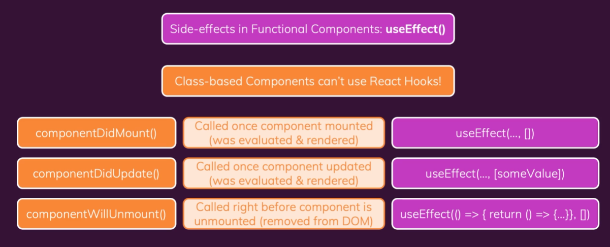

# REACT-REFERENCE
This repository is a personal reference for React concepts and snippets of code that are used daily.

<h4 align="center"> 
	References :pencil2:
</h4>

<p align="center">
 <a href="https://reactjs.org/docs/composition-vs-inheritance.html">React Oficial Docummentation</a> •
 <a href="https://www.youtube.com/watch?v=sjrW74Hx5Po&t=811s&ab_channel=FabioAkita">Setup Configuration</a> •
 <a href="https://github.com/necolas/normalize.css/">CSS Normalize</a> •
 <a href="https://www.typescriptlang.org/docs/handbook/intro.html">Typescript Handbook</a> •
 <a href="https://developer.mozilla.org/pt-BR/docs/Web/CSS">CSS Main Reference</a> •
 <a href="https://developer.mozilla.org/en-US/docs/Web/JavaScript">JS Main Reference</a> •
 <a href="https://developer.mozilla.org/en-US/docs/Web/HTML">Markup Main Reference</a> •
 <a href="https://developer.mozilla.org/en-US/docs/Web/HTTP">HTTP Main Reference</a>
</p>

## SUMMARY

  - [MAIN DOCUMENTATION CONCEPTS CLASS COMPONENTS](#main-documentation-concepts-class-components)
  - [AUTHENTICATION](#authentication)
  - [SETUP-ENVIRONMENT](#setup-environment)


## MAIN DOCUMENTATION CONCEPTS CLASS COMPONENTS

React elements are immutable. Once you create an element, you can’t change its children or attributes. An element is like a single frame in a movie: it represents the UI at a certain point in time.

React DOM compares the element and its children to the previous one, and only applies the DOM updates necessary to bring the DOM to the desired state.

The simplest way to define a component is to write a JavaScript function:

```javascript
class Welcome extends React.Component {
  render() {
    return <h1>Hello, {this.props.name}</h1>;
  }
}
```

This function is a valid React component because it accepts a single “props” (which stands for properties) object argument with data and returns a React element. We call such components “function components” because they are literally JavaScript functions.

You can also use an ES6 class to define a component:

```javascript
class Welcome extends React.Component {
  render() {
    return <h1>Hello, {this.props.name}</h1>;
  }
}
```

The above two components are equivalent from React’s point of view.

We recommend naming props from the component’s own point of view rather than the context in which it is being used.

<b>PROPS ARE READ ONLY, doesnt matter of the component is a function or a class</b>

PURE FUNCTION

```javascript
function sum(a, b) {
  return a + b;
}
```

IMPURE FUNCTION

```javascript
function withdraw(account, amount) {
  account.total -= amount;
}
```

<b>All React components must act like pure functions with respect to their props.

Converting a function to a class

You can convert a function component like Clock to a class in five steps:</b>

<ol>
  <li>Create an ES6 class, with the same name, that extends React.Component</li>
  <li>Add a single empty method to it called render()</li>
  <li>Move the body of the function into the render() method</li>
  <li>Replace props with this.props in the render() body</li>
  <li>Delete the remaining empty function declaration</li>
</ol>

```javascript
class Clock extends React.Component {
  render() {
    return (
      <div>
        <h1>Hello, world!</h1>
        ## It is {this.props.date.toLocaleTimeString()}.
      </div>
    );
  }
}
```

## Adding  Local State to a Class

We will move the date from props to state in three steps

1. Replace `this.props.date` with `this.state.date in` the render() method:

```javascript
class Clock extends React.Component {
  render() {
    return (
      <div>
        <h1>Hello, world!</h1>

      ## It is {this.state.date.toLocaleTimeString()}.
     </div>
    );
  }
}
```

2. Add a class constructor that assigns the initial this.state:

```javascript
class Clock extends React.Component {
  constructor(props) {
    super(props); //ATTENTION TO THIS
    this.state = {date: new Date()};
 }

  render() {
    return (
      <div>
        <h1>Hello, world!</h1>
        ## It is {this.state.date.toLocaleTimeString()}.
      </div>
    );
  }
}
```

Class components should always call the base constructor with props.

3. Remove the date prop from the `<Clock/>` element:

```javascript
root.render(<Clock />);
```



Class components usually are used to make error boundaries

## Error boundaries

Not possible using functional components.

```javascript
//THROW EXCEPTION INSIDE SOME COMPONENT
    if (this.props.users.length === 0) {
      throw new Error('No users provided!');
    }
```

```javascript
//CREATE ERROR BOUNDARY COMPONENT
import { Component } from 'react';

class ErrorBoundary extends Component {
  constructor() {
    super();
    this.state = { hasError: false };
  }

  componentDidCatch(error) {
    console.log(error);
    this.setState({ hasError: true });
  }

  render() {
    if (this.state.hasError) {
      return <p>Something went wrong!</p>;
    }
    return this.props.children;
  }
}

export default ErrorBoundary;
```

```javascript
//INSIDE YOU RENDER METHOD WRAPPER PARENT COMPONENT WITHIN <ErrorBoundary> tag
  render() {
    return (
      <Fragment>
        <div className={classes.finder}>
          <input type='search' onChange={this.searchChangeHandler.bind(this)} />
        </div>
        <ErrorBoundary>
          <Users users={this.state.filteredUsers} />
        </ErrorBoundary>
      </Fragment>
    );
  }
```

## Adding lifecycle methods to a class

In applications with many components, it’s very important to free up resources taken by the components when they are destroyed.

We want to set up a timer whenever the Clock is rendered to the DOM for the first time. This is called “mounting” in React.

We also want to clear that timer whenever the DOM produced by the Clock is removed. This is called “unmounting” in React.

We can declare special methods on the component class to run some code when a component mounts and unmounts:

```javascript
class Clock extends React.Component {
  constructor(props) {
    super(props);
    this.state = {date: new Date()};
  }


 componentDidMount() {
 }


 componentWillUnmount() {
 }

  render() {
    return (
      <div>
        <h1>Hello, world!</h1>
        ## It is {this.state.date.toLocaleTimeString()}.
      </div>
    );
  }
}
```

These methods are called “lifecycle methods”.

The componentDidMount() method runs after the component output has been rendered to the DOM. This is a good place to set up a timer:

```javascript
 componentDidMount() {

   this.timerID = setInterval(
     () => this.tick(),
     1000
   );
 }

 componentWillUnmount() {

   clearInterval(this.timerID);
 }
```

Finally, we will implement a method called tick() that the Clock component will run every second.

It will use this.setState() to schedule updates to the component local state:

```javascript
class Clock extends React.Component {
  constructor(props) {
    super(props);
    this.state = {date: new Date()};
  }

  componentDidMount() {
    this.timerID = setInterval(
      () => this.tick(),
      1000
    );
  }

  componentWillUnmount() {
    clearInterval(this.timerID);
  }


 tick() {
   this.setState({
     date: new Date()
   });
 }

  render() {
    return (
      <div>
        <h1>Hello, world!</h1>
        ## It is {this.state.date.toLocaleTimeString()}.
      </div>
    );
  }
}

const root = ReactDOM.createRoot(document.getElementById('root'));
root.render(<Clock />);
```

The only place where you can assign this.state is the constructor.


## Set State Updates May Be Asynchronous

React may batch multiple setState() calls into a single update for performance.

Because this.props and this.state may be updated asynchronously, you should not rely on their values for calculating the next state

For example, this code may fail to update the counter:

```javascript
// Wrong
this.setState({
  counter: this.state.counter + this.props.increment,
});

To fix it, use a second form of setState() that accepts a function rather than an object. That function will receive the previous state as the first argument, and the props at the time the update is applied as the second argument:

// Correct
this.setState((state, props) => ({
  counter: state.counter + props.increment
}));

// Correct
this.setState(function(state, props) {
  return {
    counter: state.counter + props.increment
  };
});
```

## State Updates are Merged

When you call setState(), React merges the object you provide into the current state.

## The Data Flows Down

This is commonly called a “top-down” or “unidirectional” data flow. Any state is always owned by some specific component, and any data or UI derived from that state can only affect components “below” them in the tree.

## Handling Events

React events are named using camelCase, rather than lowercase. For example:

HTML

```javascript
<button onclick="activateLasers()">
  Activate Lasers
</button>
```

REACT 

<button onClick={activateLasers}>
  Activate Lasers
</button>

When you define a component using an ES6 class, <b>a common pattern is for an event handler to be a method on the class.</b> For example, this Toggle component renders a button that lets the user toggle between “ON” and “OFF” states:

```javascript
class Toggle extends React.Component {
  constructor(props) {
    super(props);
    this.state = {isToggleOn: true};

    // This binding is necessary to make `this` work in the callback
    this.handleClick = this.handleClick.bind(this);
  }

  handleClick() {
    this.setState(prevState => ({
      isToggleOn: !prevState.isToggleOn
    }));
  }

  render() {
    return (
      <button onClick={this.handleClick}>
        {this.state.isToggleOn ? 'ON' : 'OFF'}
      </button>
    );
  }
}
```

You have to be careful about the meaning of this in JSX callbacks. In JavaScript, class methods are not bound by default. If you forget to bind this.handleClick and pass it to onClick, this will be undefined when the function is actually called.

This is not React-specific behavior; it is a part of how functions work in JavaScript. Generally, <b>if you refer to a method without () after it</b>, such as onClick={this.handleClick}, you should bind that method.

```javascript
class LoggingButton extends React.Component {
  // This syntax ensures `this` is bound within handleClick.
  handleClick = () => {
    console.log('this is:', this);
  };
  render() {
    return (
      <button onClick={this.handleClick}>
        Click me
      </button>
    );
  }
}
```

If you aren’t using class fields syntax, you can use an arrow function in the callback:

```javascript
class LoggingButton extends React.Component {
  handleClick() {
    console.log('this is:', this);
  }

  render() {
    // This syntax ensures `this` is bound within handleClick
    return (
      <button onClick={() => this.handleClick()}>
        Click me
      </button>
    );
  }
}
```

The problem with this syntax is that a different callback is created each time the LoggingButton renders. In most cases, this is fine. However, if this callback is passed as a prop to lower components, those components might do an extra re-rendering. <b>We generally recommend binding in the constructor or using the class fields syntax, to avoid this sort of performance problem.</b>

## Passing Arguments to Event Handlers

Inside a loop, it is common to want to pass an extra parameter to an event handler. For example, if id is the row ID, either of the following would work:

```javascript
<button onClick={(e) => this.deleteRow(id, e)}>Delete Row</button>
<button onClick={this.deleteRow.bind(this, id)}>Delete Row</button>
```

The above two lines are equivalent, and use arrow functions and Function.prototype.bind respectively.

In both cases, the e argument representing the React event will be passed as a second argument after the ID. With an arrow function, we have to pass it explicitly, but with bind any further arguments are automatically forwarded.

## Conditional Rendering

```javascript
class LoginControl extends React.Component {
  constructor(props) {
    super(props);
    //binding on constructor
    this.handleLoginClick = this.handleLoginClick.bind(this);
    this.handleLogoutClick = this.handleLogoutClick.bind(this);
    this.state = {isLoggedIn: false};
  }

  handleLoginClick() {
    this.setState({isLoggedIn: true});
  }

  handleLogoutClick() {
    this.setState({isLoggedIn: false});
  }

  render() {
    const isLoggedIn = this.state.isLoggedIn;
    let button;
    if (isLoggedIn) {
      button = <LogoutButton onClick={this.handleLogoutClick} />;
    } else {
      button = <LoginButton onClick={this.handleLoginClick} />;
    }

    return (
      <div>
        <Greeting isLoggedIn={isLoggedIn} />
        {button}
      </div>
    );
  }
}

const root = ReactDOM.createRoot(document.getElementById('root')); 
root.render(<LoginControl />);
```

Using ternary to conditional render

```javascript
render() {
  const isLoggedIn = this.state.isLoggedIn;
  return (
    <div>
      {isLoggedIn
        ? <LogoutButton onClick={this.handleLogoutClick} />
        : <LoginButton onClick={this.handleLoginClick} />
      }
    </div>
  );
}
```

Just like in JavaScript, it is up to you to choose an appropriate style based on what you and your team consider more readable. 

<b>VERY GOOD TIP:
Also remember that whenever conditions become too complex, it might be a good time to extract a component.</b>

## Preventing Component from Rendering

In rare cases you might want a component to hide itself even though it was rendered by another component. To do this return null instead of its render output.

```javascript
function WarningBanner(props) {
  if (!props.warn) {
    return null;
  }

  return (
    <div className="warning">
      Warning!
    </div>
  );
}

class Page extends React.Component {
  constructor(props) {
    super(props);
    this.state = {showWarning: true};
    this.handleToggleClick = this.handleToggleClick.bind(this);
  }

  handleToggleClick() {
    this.setState(state => ({
      showWarning: !state.showWarning
    }));
  }

  render() {
    return (
      <div>
        <WarningBanner warn={this.state.showWarning} />
        <button onClick={this.handleToggleClick}>
          {this.state.showWarning ? 'Hide' : 'Show'}
        </button>
      </div>
    );
  }
}

const root = ReactDOM.createRoot(document.getElementById('root')); 
root.render(<Page />);
```

Returning null from a component’s render method does not affect the firing of the component’s lifecycle methods. For instance componentDidUpdate will still be called.

## Keys

Keys help React identify which items have changed, are added, or are removed. Keys should be given to the elements inside the array to give the elements a stable identity:

We don’t recommend using indexes for keys if the order of items may change. This can negatively impact performance and may cause issues with component state.

<h3>Keys Must Only Be Unique Among Siblings</h3>

Keys used within arrays should be unique among their siblings. However, they don’t need to be globally unique. We can use the same keys when we produce two different arrays:

Keys serve as a hint to React but they don’t get passed to your components. If you need the same value in your component, pass it explicitly as a prop with a different name:

```javascript
const content = posts.map((post) =>
  <Post
    key={post.id}
    id={post.id}
    title={post.title} />
);
```

With the example above, the Post component can read props.id, but not props.key.

## Forms

HTML form elements work a bit differently from other DOM elements in React, because form elements naturally keep some internal state. For example, this form in plain HTML accepts a single name:

```html
<form>
  <label>
    Name:
    <input type="text" name="name" />
  </label>
  <input type="submit" value="Submit" />
</form>
```

This form has the default HTML form behavior of browsing to a new page when the user submits the form. If you want this behavior in React, it just works. But in most cases, it’s convenient to have a JavaScript function that handles the submission of the form and has access to the data that the user entered into the form. The standard way to achieve this is with a technique called “controlled components”.

## Controled Components

In HTML, form elements such as `<input>`, `<textarea>`, and `<select>` typically maintain their own state and update it based on user input. In React, mutable state is typically kept in the state property of components, and only updated with setState().

We can combine the two by making the React state be the <b>single source of truth</b>. Then the React component that renders a form also controls what happens in that form on subsequent user input. An input form element whose value is controlled by React in this way is called a controlled component.

```javascript
class NameForm extends React.Component {
  constructor(props) {
    super(props);
    this.state = {value: ''};

    this.handleChange = this.handleChange.bind(this);
    this.handleSubmit = this.handleSubmit.bind(this);
  }

  handleChange(event) {
    this.setState({value: event.target.value});
  }

  handleSubmit(event) {
    alert('A name was submitted: ' + this.state.value);
    event.preventDefault();
  }

  render() {
    return (
      <form onSubmit={this.handleSubmit}>
        <label>
          Name:
          <input type="text" value={this.state.value} onChange={this.handleChange} />
        </label>
        <input type="submit" value="Submit" />
      </form>
    );
  }
}
```

## The textarea Tag

The textarea Tag

```html
<textarea>
  Hello there, this is some text in a text area
</textarea>
```


```javascript
class EssayForm extends React.Component {
  constructor(props) {
    super(props);
    this.state = {
      value: 'Please write an essay about your favorite DOM element.'
    };

    this.handleChange = this.handleChange.bind(this);
    this.handleSubmit = this.handleSubmit.bind(this);
  }

  handleChange(event) {
    this.setState({value: event.target.value});
  }

  handleSubmit(event) {
    alert('An essay was submitted: ' + this.state.value);
    event.preventDefault();
  }

  render() {
    return (
      <form onSubmit={this.handleSubmit}>
        <label>
          Essay:
          <textarea value={this.state.value} onChange={this.handleChange} />
        </label>
        <input type="submit" value="Submit" />
      </form>
    );
  }
}
```

## The file input Tag

In HTML, an `<input type="file">` lets the user choose one or more files from their device storage to be uploaded to a server or manipulated by JavaScript via the File API.

```html
<input type="file" />
```

Because its value is read-only, it is an <b>uncontrolled</b> component in React. It is discussed together with other uncontrolled components later in the documentation.

<b>Handling Multiple Inputs</b>

When you need to handle multiple controlled input elements, you can add a name attribute to each element and let the handler function choose what to do based on the value of event.target.name.

```javascript
class Reservation extends React.Component {
  constructor(props) {
    super(props);
    this.state = {
      isGoing: true,
      numberOfGuests: 2
    };

    this.handleInputChange = this.handleInputChange.bind(this);
  }

  handleInputChange(event) {
    const target = event.target;
    const value = target.type === 'checkbox' ? target.checked : target.value;
    const name = target.name;

    this.setState({
      [name]: value
    });
  }

  render() {
    return (
      <form>
        <label>
          Is going:
          <input
            name="isGoing"
            type="checkbox"
            checked={this.state.isGoing}
            onChange={this.handleInputChange} />
        </label>
        <br />
        <label>
          Number of guests:
          <input
            name="numberOfGuests"
            type="number"
            value={this.state.numberOfGuests}
            onChange={this.handleInputChange} />
        </label>
      </form>
    );
  }
}
```

Note how we used the ES6 computed property name syntax to update the state key corresponding to the given input name:

```javascript
this.setState({
  [name]: value
});
```

Also, since setState() automatically <b>merges a partial state into the current state</b>, we only needed to call it with the changed parts.

HINT: FORMIK

## Lifting State Up

```javascript
class TemperatureInput extends React.Component {
  constructor(props) {
    super(props);
    this.handleChange = this.handleChange.bind(this);
  }

  handleChange(e) {
    this.props.onTemperatureChange(e.target.value);
  }

  render() {
    const temperature = this.props.temperature;
    const scale = this.props.scale;
    return (
      <fieldset>
        <legend>Enter temperature in {scaleNames[scale]}:</legend>
        <input value={temperature}
               onChange={this.handleChange} />
      </fieldset>
    );
  }
}
```

```javascript
class Calculator extends React.Component {
  constructor(props) {
    super(props);
    this.handleCelsiusChange = this.handleCelsiusChange.bind(this);
    this.handleFahrenheitChange = this.handleFahrenheitChange.bind(this);
    this.state = {temperature: '', scale: 'c'};
  }

  handleCelsiusChange(temperature) {
    this.setState({scale: 'c', temperature});
  }

  handleFahrenheitChange(temperature) {
    this.setState({scale: 'f', temperature});
  }

  render() {
    const scale = this.state.scale;
    const temperature = this.state.temperature;
    const celsius = scale === 'f' ? tryConvert(temperature, toCelsius) : temperature;
    const fahrenheit = scale === 'c' ? tryConvert(temperature, toFahrenheit) : temperature;

    return (
      <div>
        <TemperatureInput
          scale="c"
          temperature={celsius}
          onTemperatureChange={this.handleCelsiusChange} />
        <TemperatureInput
          scale="f"
          temperature={fahrenheit}
          onTemperatureChange={this.handleFahrenheitChange} />
        <BoilingVerdict
          celsius={parseFloat(celsius)} />
      </div>
    );
  }
}
```

## Very Important Concepts

There should be a <b>single “source of truth”</b> for any data that changes in a React application. Usually, the state is first added to the component that needs it for rendering. Then, if other components also need it, you can lift it up to their closest common ancestor. Instead of trying to sync the state between different components, you should rely on the top-down data flow.

Lifting state involves writing more “boilerplate” code than two-way binding approaches, but as a benefit, it takes less work to find and isolate bugs. Since any state “lives” in some component and that component alone can change it, the surface area for bugs is greatly reduced. Additionally, you can implement any custom logic to reject or transform user input.

If something can be derived from either props or state, it probably shouldn’t be in the state.

## Composition vs Inheritance

React has a powerful composition model, and it is recommended <b>using composition instead of inheritance</b> to reuse code between components.

<h3>Containment</h3>

Some components don’t know their children ahead of time. This is especially common for components like Sidebar or Dialog that represent generic “boxes”.

We recommend that such components use the special children prop to pass children elements directly into their output:

```javascript
function FancyBorder(props) {
  return (
    <div className={'FancyBorder FancyBorder-' + props.color}>
      {props.children} //can pass entirely markup code through this
    </div>
  );
}
```

Passing HTML inside component as a prop

```javascript
function WelcomeDialog() {
  return (
    <FancyBorder color="blue">
      <h1 className="Dialog-title">
        Welcome
      </h1>
      <p className="Dialog-message">
        Thank you for visiting our spacecraft!
      </p>
    </FancyBorder>
  );
}
```

```javascript
function SplitPane(props) {
  return (
    <div className="SplitPane">
      <div className="SplitPane-left">
        {props.left}
      </div>
      <div className="SplitPane-right">
        {props.right}
      </div>
    </div>
  );
}

function App() {
  return (
    <SplitPane
      left={
        <Contacts />
      }
      right={
        <Chat />
      } />
  );
}
```

React elements like `<Contacts />` and `<Chat />` are just objects, so you can pass them as props like any other data. This approach may remind you of “slots” in other libraries but <b>there are no limitations on what you can pass as props in React</b>.

<h3>Specialization</h3>

Sometimes we think about components as being “special cases” of other components. For example, we might say that a WelcomeDialog is a special case of Dialog.

In React, this is also achieved by composition, where a more “specific” component renders a more “generic” one and configures it with props:

```javascript
function Dialog(props) {
  return (
    <FancyBorder color="blue">
      <h1 className="Dialog-title">
        {props.title}
      </h1>
      <p className="Dialog-message">
        {props.message}
      </p>
    </FancyBorder>
  );
}

function WelcomeDialog() {
  return (
    <Dialog
      title="Welcome"
      message="Thank you for visiting our spacecraft!" />
  );
}
```

Composition works equally well for components defined as classes:

```javascript
function Dialog(props) {
  return (
    <FancyBorder color="blue">
      <h1 className="Dialog-title">
        {props.title}
      </h1>
      <p className="Dialog-message">
        {props.message}
      </p>
      {props.children}
    </FancyBorder>
  );
}

class SignUpDialog extends React.Component {
  constructor(props) {
    super(props);
    this.handleChange = this.handleChange.bind(this);
    this.handleSignUp = this.handleSignUp.bind(this);
    this.state = {login: ''};
  }

  render() {
    return (
      <Dialog title="Mars Exploration Program"
              message="How should we refer to you?">
        <input value={this.state.login}
               onChange={this.handleChange} />
        <button onClick={this.handleSignUp}>
          Sign Me Up!
        </button>
      </Dialog>
    );
  }

  handleChange(e) {
    this.setState({login: e.target.value});
  }

  handleSignUp() {
    alert(`Welcome aboard, ${this.state.login}!`);
  }
}
```

<b>Environment</b>

Extensions

## Thinking in React

### Step 1: Break The UI Into A Component Hierarchy

The first thing you’ll want to do is to draw boxes around every component (and subcomponent) in the mock and give them all names.

But how do you know what should be its own component? Use the same techniques for deciding if you should create a new function or object. One such technique is the single responsibility principle, that is, a component should ideally only do one thing. If it ends up growing, it should be decomposed into smaller subcomponents.

Since you’re often displaying a JSON data model to a user, you’ll find that if your model was built correctly, your UI (and therefore your component structure) will map nicely. That’s because <b>UI and data models tend to adhere to the same information architecture</b>. Separate your UI into components, where each component matches one piece of your data model.

Now that we’ve identified the components in our mock, let’s arrange them into a hierarchy. Components that appear within another component in the mock should appear as a child in the hierarchy:

<ul>
  <li>FilterableProductTable</li>
  <ul>
    <li>SearchBar</li>
    <li>ProductTable</li>
    <ul>
      <li>ProductCategoryRow</li>
      <li>ProductRow</li>
    </ul>
  </ul>
</ul>

### Step 2: Build A Static Version in React

<b>Very important conpects here</b>

Now that you have your component hierarchy, it’s time to implement your app. The easiest way is to build a version that takes your data model and renders the UI but has no interactivity. It’s best to decouple these processes because building a static version requires a lot of typing and no thinking, and adding interactivity requires a lot of thinking and not a lot of typing. We’ll see why.

To build a static version of your app that renders your data model, you’ll want to build components that reuse other components and pass data using props. props are a way of passing data from parent to child. If you’re familiar with the concept of state, <b>don’t use state</b> at all to build this static version. State is reserved only for interactivity, that is, data that changes over time. Since this is a static version of the app, you don’t need it.

You can build top-down or bottom-up. That is, you can either start with building the components higher up in the hierarchy (i.e. starting with FilterableProductTable) or with the ones lower in it (ProductRow). In simpler examples, it’s usually easier to go top-down, <b>and on larger projects, it’s easier to go bottom-up and write tests as you build</b>.

At the end of this step, you’ll have a library of reusable components that render your data model. The components will only have render() methods since this is a static version of your app. The component at the top of the hierarchy (FilterableProductTable) will take your data model as a prop. If you make a change to your underlying data model and call root.render() again, the UI will be updated. You can see how your UI is updated and where to make changes. React’s one-way data flow (also called one-way binding) keeps everything modular and fast.

### Step 3: Identify The Minimal (but complete) Representation Of UI State

To build your app correctly, you first need to think of the minimal set of mutable state that your app needs. The key here is DRY: Don’t Repeat Yourself. Figure out the absolute minimal representation of the state your application needs and compute everything else you need on-demand. For example, <b>if you’re building a TODO list, keep an array of the TODO items around; don’t keep a separate state variable for the count. Instead, when you want to render the TODO count, take the length of the TODO items array</b>.

Think of all the pieces of data in our example application. We have:

<ul>
  <li>The original list of products</li>
  <li>The search text the user has entered</li>
  <li>The value of the checkbox</li>
  <li>The filtered list of products</li>
</ul>

Let’s go through each one and figure out which one is state. Ask three questions about each piece of data:

<b>BIG HINT</b>

<ol>
  <li>Is it passed in from a parent via props? If so, it probably isn’t state.</li>
  <li>Does it remain unchanged over time? If so, it probably isn’t state.</li>
  <li>Can you compute it based on any other state or props in your component? If so, it isn’t state.</li>
</ol>

### Step 4: Identify Where Your State Should Live

### Step 5: Add Inverse Data Flow

## AUTHENTICATION

Lock API endpoints and content that should be private.

Two-step process:

1 - Get access / permission
2 - Send request to protected resource

Client --> Request (with user credentials) --> Server
<--         Response (Yes/No)       <--

Is that enough ?

A "yes" alone is not enough to then access protected resources (API endpoints). Because a "yes" or "no" is very easy to fake.

There are two approaches
<ul>
  <li>Server-side sessions</li>
  <ul>
    <li>Store unique identifier on server, send same identifier to client (use on requests)</li>
    <li>It is only good when front end and backend are tighly coupled otherwise, if frontend is deployed on server A (single-page application)and API on server B, it is not good idea</li>
  </ul>
  <li>Authentication Tokens</li>
  <ul>
    <li>Create (but not store) "permission" token on server, send token to client</li>
    <li>Client sends token along with requests to protect resources</li>
    <li>Good for threating decoupled frontend and backend</li>
  </ul>
</ul>

## CAREFULL

Be carefull with copying <b>objects and arrays</b> to const or variables, because the reference keeps so it can generate unexpected behaviors on React code

```javascript
const person = {
  name: 'Max'
}

const secondPerson = person;

person.name = 'Manu';

console.log(secondPerson); // Manu
```

Right way of doing that.

```javascript
const person = {
  name: 'Max'
}

const secondPerson = {
  ...person //keeps all properties
};

person.name = 'Manu';

console.log(secondPerson); // Max
```

## BROWSER

## JS tips

Can use trim to dicart blank spaces.

```javascript
  if(enteredValue.trim().length){

  }

  if(event.target.valuetrim().length > 0){
    setIsValid(true)
  }
```

## CSS ALTERNATIVES

<ul>
  <li>Styled Components</li>
  <li>CSS Modules Stylesheet</li>
</ul>

## STYLED COMPONENTS

```javascript
import styled from 'styled-components';

const Button = styled.button`
.button
  font: inherit;
  padding: 0.5rem 1.5rem;
  border: 1px solid #8b005d;
  color: white;
  background: #8b005d;
  box-shadow: 0 0 4px rgba(0, 0, 0, 0.26);
  cursor: pointer;


&:focus
  outline: none;

&:hover,
&:active
  background: #ac0e77;
  border-color: #ac0e77;
  box-shadow: 0 0 8px rgba(0, 0, 0, 0.26);
`;

// const Button = props => {
//   return (
//     <button type={props.type} className="button" onClick={props.onClick}>
//       {props.children}
//     </button>
//   );
// };

export default Button;
```

Another example:

```javascript
import React, { useState } from "react";
import styled from "styled-components";

import Button from "../../UI/Button/Button";
import "./CourseInput.css";

const FormControl = styled.div`
  margin: 0.5rem 0;

  & label {
    font-weight: bold;
    display: block;
    margin-bottom: 0.5rem;
    color: ${props => props.invalid ? 'red' : 'black'};
  }

  & input {
    display: block;
    width: 100%;
    border: 1px solid ${props => props.invalid ? 'red' : '#ccc'};
    background: ${props => props.invalid ? '#fad0ec' : 'transparent'};
    font: inherit;
    line-height: 1.5rem;
    padding: 0 0.25rem;
  }

  & input:focus {
    outline: none;
    background: #fad0ec;
    border-color: #8b005d;
  }
`;

const CourseInput = (props) => {
  const [enteredValue, setEnteredValue] = useState("");
  const [isValid, setIsValid] = useState(true);

  const goalInputChangeHandler = (event) => {
    if (event.target.value.trim().length > 0) {
      setIsValid(true);
    }
    setEnteredValue(event.target.value);
  };

  const formSubmitHandler = (event) => {
    event.preventDefault();
    if (enteredValue.trim().length === 0) {
      setIsValid(false);
      return;
    }
    props.onAddGoal(enteredValue);
  };

  return (
    <form onSubmit={formSubmitHandler}>
      <FormControl invalid={!isValid}>
        <label>Course Goal</label>
        <input type="text" onChange={goalInputChangeHandler} />
      </FormControl>
      <Button type="submit">Add Goal</Button>
    </form>
  );
};

export default CourseInput;
```

## CSS MODULES STYLESHEET

Generates unique DOM class names

```css
/*
FILE NAME: Button.module.css
*/

.button {
  font: inherit;
  padding: 0.5rem 1.5rem;
  border: 1px solid #8b005d;
  color: white;
  background: #8b005d;
  box-shadow: 0 0 4px rgba(0, 0, 0, 0.26);
  cursor: pointer;
}

.button:focus {
  outline: none;
}

.button:hover,
.button:active {
  background: #ac0e77;
  border-color: #ac0e77;
  box-shadow: 0 0 8px rgba(0, 0, 0, 0.26);
}
```

```javascript
import React from 'react';
import styles from './Button.module.css'

const Button = props => {
  return (
    <button type={props.type} className={styles.button} onClick={props.onClick}>
      {props.children}
    </button>
  );
};

export default Button;
```

## JSX

You can't return more than one "root" jsx element because of course a return by default on javascript can only return a single value.

Jsx code translates in:

```javascript
return{
  React.createElement('h2',{},'Hi there!')
}
```

## FRAGMENTS

To avoid use of tons of unnecessary <div>, we can use a resource called fragment.

```html
<div>
  <div>
    <div>
      <div>
        <div>
          <h2>Random content</h2>
        </div>
      </div>
    </div>
  </div>
</div>
```

That is basically a empty wrapper
```javascript
const Wrapper = props => {
    return props.children;
};

export default Wrapper
  ```

```javascript
  return(
    <React.Fragment>
      <h2>Hi there!</h2>
      <p>Finish!</p>
    </React.Fragment>
  );
  ```

  ```javascript
  return(
    <>
      <h2>Hi there!</h2>
      <p>Finish!</p>
    </>
  );
```

## PORTAL

TIP: RECOMMENDED TO USE TO MAKE MODALS

Move your component to be rendered on another place inside the HTML DOM,
it is possible to make a comparison to a portal:

Example of error modal being rendered on the top of the DOM

```javascript
const Backdrop = (props) => {return (
  <div className={classes.backdrop} onClick={props.onConfirm} />);
};

const ModalOverlay = (props) => {  return (
  <Card className={classes.modal}>
  <header className={classes.header}>
    <h2>{props.title}</h2>
  </header>
  <div className={classes.content}>
    <p>{props.message}</p>
  </div>
  <footer className={classes.actions}>
    <Button onClick={props.onConfirm}>Okay</Button>
  </footer>
</Card>  );
};

const ErrorModal = (props) => {
  return (
    <React.Fragment>
      {ReactDOM.createPortal(<Backdrop onConfirm={props.onConfirm}/>, document.getElementById('backdrop-root'))}
      {ReactDOM.createPortal(<ModalOverlay title={props.title} message={props.message} onConfirm={props.onConfirm}/>, document.getElementById('overlay-root'))}
    </React.Fragment>
  );
};

export default ErrorModal;
```

Snippet of the Html DOM 

```html
  <body>
    <noscript>You need to enable JavaScript to run this app.</noscript>
    <div id="backdrop-root"></div>
    <div id="overlay-root"></div>
    <div id="root"></div>
  </body>
```
## REF

IMPORTANT: CAN ONLY BE USED INSIDE FUNCTIONAL COMPONENTS
           CAN REF ANY HTML ELEMENT
           IT IS NOT RECOMMENDED USING REF TO MANIPULATE THE DOM
           RECOMMEND TO READ VALUES, STATE CAN BE UNNECESSARY CODE MAYBE

Connect variable with DOM element, will attribute to a variable an object
that represents a DOM element.

Look on the example below how we can change input value using `nameInputRef.current.value = '';`

```javascript
const AddUser = (props) => {
  const nameInputRef = useRef();
  const ageInputRef = useRef();

  const [error, setError] = useState();

  const addUserHandler = (event) => {
    event.preventDefault();
    console.log(nameInputRef.current.value)
    const enteredName = nameInputRef.current.value;
    const enteredUserAge = ageInputRef.current.value;
    if (enteredName.trim().length === 0 || enteredUserAge.trim().length === 0) {
      setError({
        title: 'Invalid input',
        message: 'Please enter a valid name and age (non-empty values).',
      });
      return;
    }
    if (+enteredUserAge < 1) {
      setError({
        title: 'Invalid age',
        message: 'Please enter a valid age (> 0).',
      });
      return;
    }
    props.onAddUser(enteredName, enteredUserAge);
    
    nameInputRef.current.value = '';
    ageInputRef.current.value = '';
  };

  const errorHandler = () => {
    setError(null);
  };

  return (
<Wrapper>
      {error && (
        <ErrorModal
          title={error.title}
          message={error.message}
          onConfirm={errorHandler}
        />
      )}
      <Card className={classes.input}>
        <form onSubmit={addUserHandler}>
          <label htmlFor="username">Username</label>
          <input
            id="username"
            type="text"
            ref={nameInputRef}
          />
          <label htmlFor="age">Age (Years)</label>
          <input
            id="age"
            type="number"
            ref={ageInputRef}
          />
          <Button type="submit">Add User</Button>
        </form>
      </Card>
</Wrapper>
  );
};

export default AddUser;

```

## LOCAL STORAGE

There is a way of natively using local storage in react `localStorage`. Very good example below about,
how to maintain user logged after first login, after user access site again.

```javascript
import React, { useState, useEffect } from 'react';

//use effect can`t be an async function

import Login from './components/Login/Login';
import Home from './components/Home/Home';
import MainHeader from './components/MainHeader/MainHeader';

function App() {
  const [isLoggedIn, setIsLoggedIn] = useState(false);

  useEffect(()=>{
    const storedUserLoggedInInformation = localStorage.getItem('isLoggedIn');

    if(storedUserLoggedInInformation === '1'){
      setIsLoggedIn(true);
    }
  },[]);

  const loginHandler = (email, password) => {
    // We should of course check email and password
    // But it's just a dummy/ demo anyways
    localStorage.setItem('isLoggedIn', '1');
    setIsLoggedIn(true);
  };

  const logoutHandler = () => {
    localStorage.removeItem('isLoggedIn');
    setIsLoggedIn(false);
  };

  return (
    <React.Fragment>
      <MainHeader isAuthenticated={isLoggedIn} onLogout={logoutHandler} />
      <main>
        {!isLoggedIn && <Login onLogin={loginHandler} />}
        {isLoggedIn && <Home onLogout={logoutHandler} />}
      </main>
    </React.Fragment>
  );
}

export default App;
```

## DEBOUNCE

Calls a function after a first call only after a certein amount of time. It is ideal as an example if you want to send http
requests. The code below contains an example about how to implement debouncing using useEffect:

Attention to the clean up function 

//IMPORTANT: clean up process, runs before user effect executes it's function next time, EXCEPT FOR THE FIRST TIME IT RUNS
//and also important to say that it will run before the component unmounts from the DOM
//clean ups timer

```javascript
import React, { useState, useEffect } from 'react';

import Card from '../UI/Card/Card';
import classes from './Login.module.css';
import Button from '../UI/Button/Button';

const Login = (props) => {
  const [enteredEmail, setEnteredEmail] = useState('');
  const [emailIsValid, setEmailIsValid] = useState();
  const [enteredPassword, setEnteredPassword] = useState('');
  const [passwordIsValid, setPasswordIsValid] = useState();
  const [formIsValid, setFormIsValid] = useState(false);

  useEffect(() => {
    const identifier = setTimeout(()=>{
      console.log('Checking form validity!');
      setFormIsValid(
        enteredEmail.includes('@') && enteredPassword.trim().length > 6
      );
    },500);
    //IMPORTANT: clean up process, runs before user effect executes it's function next time, EXCEPT FOR THE FIRST TIME IT RUNS
    //and also important to say that it will run before the component unmounts from the DOM
    //clean ups timer
    return () => {
      console.log('clean up')
      clearTimeout(identifier);
    };
  },[enteredEmail, enteredPassword])

  const emailChangeHandler = (event) => {
    setEnteredEmail(event.target.value);
  };

  const passwordChangeHandler = (event) => {
    setEnteredPassword(event.target.value);

    setFormIsValid(
      event.target.value.trim().length > 6 && enteredEmail.includes('@')
    );
  };

  const validateEmailHandler = () => {
    setEmailIsValid(enteredEmail.includes('@'));
  };

  const validatePasswordHandler = () => {
    setPasswordIsValid(enteredPassword.trim().length > 6);
  };

  const submitHandler = (event) => {
    event.preventDefault();
    props.onLogin(enteredEmail, enteredPassword);
  };

  return (
    <Card className={classes.login}>
      <form onSubmit={submitHandler}>
        <div
          className={`${classes.control} ${
            emailIsValid === false ? classes.invalid : ''
          }`}
        >
          <label htmlFor="email">E-Mail</label>
          <input
            type="email"
            id="email"
            value={enteredEmail}
            onChange={emailChangeHandler}
            onBlur={validateEmailHandler}
          />
        </div>
        <div
          className={`${classes.control} ${
            passwordIsValid === false ? classes.invalid : ''
          }`}
        >
          <label htmlFor="password">Password</label>
          <input
            type="password"
            id="password"
            value={enteredPassword}
            onChange={passwordChangeHandler}
            onBlur={validatePasswordHandler}
          />
        </div>
        <div className={classes.actions}>
          <Button type="submit" className={classes.btn} disabled={!formIsValid}>
            Login
          </Button>
        </div>
      </form>
    </Card>
  );
};

export default Login;
```

## Make requests

## Avoiding bugs when fetching

When using external state inside function that is fetching data and being used on useEffect
good practice is using useCallback

```javascript
  const fetchMoviesHandler = useCallback(async () => {
    setIsLoading(true);
    setError(null);
    try {
      const response = await fetch('https://react-http-6b4a6.firebaseio.com/movies.json');
      if (!response.ok) {
        throw new Error('Something went wrong!');
      }

      const data = await response.json();

      const loadedMovies = [];

      for (const key in data) {
        loadedMovies.push({
          id: key,
          title: data[key].title,
          openingText: data[key].openingText,
          releaseDate: data[key].releaseDate,
        });
      }

      setMovies(loadedMovies);
    } catch (error) {
      setError(error.message);
    }
    setIsLoading(false);
  }, []);

  useEffect(() => {
    fetchMoviesHandler();
  }, [fetchMoviesHandler]);

  //example response data not returning, promise to useEffect
  // promise can`t be handled by try catch it is necessary to add fetchMeals.fetch()
  useEffect(()=>{
    const fetchMeals = async () => {
      const response = await fetch('your url.com');
      const responseData = await response.json();

      const loadedMeals = [];

      for(const key in responseData){
        loadedMeals.push({
          id: key,
          name: respondeData[key].name,
        })
      }
    }
  })
```

### Database Interaction

Web app should never interact directly with database, because it is quite insecure. It would expose
your database credentials in the code, this is done by some backend app, users will never have access
to it once it is on a different server.

```javascript
  //WITHOUT async or await
  function fetchMovieHandler() {
    fetch('https://swapi.dev/api/films/').then(response => {
      return response.json();
    }).then(data => {
      const transformedMovies = data.results.map(movieData => {
        return {
          id: movieData.episode_id,
          title: movieData.title,
          openingText: movieData.opening_crawl,
          releaseDate: movieData.release_date
        };
      });
      setMovies(transformedMovies);
    });
  }
```

```javascript
  //WITH async or await
    async function fetchMovieHandler() {
    const response = await fetch('https://swapi.dev/api/films/');
    const data = await response.json();
    
    const transformMovies = data.results.map((movieData) => {
      return {
        id: movieData.episode_id,
        title: movieData.title,
        openingText: movieData.opening_crawl,
        releaseDate: movieData.release_date
      };
    });

    setMovies(transformMovies);
    }
```

### Http Requests & Using Responses

## useReducer()

Manage more complex states (multiple states).

Example of use: when updating a state that depends on another state

```javascript
const [state, dispatchFn] = useReducer(reducerFn, initialState, initFn);
```

state = the state snapshot used in the component re-render/re-evaluation cycle;
dispatchFn = a function that can be used to dispatch a new action (ex: trigger an update of the state)(can be any action you want);
reducerFn = a function that is triggered automatically once an action is dispatched (via dispatchFn()) it
receives the latest state snapshot and should return the new, updated state;
initialState = the initial state;
initFn = a function to set the initial state programmatically;


```javascript
import React, { useState, useEffect, useReducer } from 'react';

import Card from '../UI/Card/Card';
import classes from './Login.module.css';
import Button from '../UI/Button/Button';

const emailReducer = (state, action) => {
  if (action.type === 'USER_INPUT') {
    return { value: action.val, isValid: action.val.includes('@') };
  }
  if (action.type === 'INPUT_BLUR') {
    return { value: state.value, isValid: state.value.includes('@') };
  }
  return { value: '', isValid: false };
};

const passwordReducer = (state, action) => {
  if (action.type === 'USER_INPUT') {
    return { value: action.val, isValid: action.val.trim().length > 6 };
  }
  if (action.type === 'INPUT_BLUR') {
    return { value: state.value, isValid: state.value.trim().length > 6 };
  }
  return { value: '', isValid: false };
};

const Login = (props) => {
  // const [enteredEmail, setEnteredEmail] = useState('');
  // const [emailIsValid, setEmailIsValid] = useState();
  // const [enteredPassword, setEnteredPassword] = useState('');
  // const [passwordIsValid, setPasswordIsValid] = useState();
  const [formIsValid, setFormIsValid] = useState(false);

  const [emailState, dispatchEmail] = useReducer(emailReducer, {
    value: '',
    isValid: null,
  });
  const [passwordState, dispatchPassword] = useReducer(passwordReducer, {
    value: '',
    isValid: null,
  });

  useEffect(() => {
    console.log('EFFECT RUNNING');

    return () => {
      console.log('EFFECT CLEANUP');
    };
  }, []);

  const { isValid: emailIsValid } = emailState;
  const { isValid: passwordIsValid } = passwordState;

  useEffect(() => {
    const identifier = setTimeout(() => {
      console.log('Checking form validity!');
      setFormIsValid(emailIsValid && passwordIsValid);
    }, 500);

    return () => {
      console.log('CLEANUP');
      clearTimeout(identifier);
    };
  }, [emailIsValid, passwordIsValid]);

  const emailChangeHandler = (event) => {
    dispatchEmail({ type: 'USER_INPUT', val: event.target.value });

    // setFormIsValid(
    //   event.target.value.includes('@') && passwordState.isValid
    // );
  };

  const passwordChangeHandler = (event) => {
    dispatchPassword({ type: 'USER_INPUT', val: event.target.value });

    // setFormIsValid(emailState.isValid && event.target.value.trim().length > 6);
  };

  const validateEmailHandler = () => {
    dispatchEmail({ type: 'INPUT_BLUR' });
  };

  const validatePasswordHandler = () => {
    dispatchPassword({ type: 'INPUT_BLUR' });
  };

  const submitHandler = (event) => {
    event.preventDefault();
    props.onLogin(emailState.value, passwordState.value);
  };

  return (
    <Card className={classes.login}>
      <form onSubmit={submitHandler}>
        <div
          className={`${classes.control} ${
            emailState.isValid === false ? classes.invalid : ''
          }`}
        >
          <label htmlFor="email">E-Mail</label>
          <input
            type="email"
            id="email"
            value={emailState.value}
            onChange={emailChangeHandler}
            onBlur={validateEmailHandler}
          />
        </div>
        <div
          className={`${classes.control} ${
            passwordState.isValid === false ? classes.invalid : ''
          }`}
        >
          <label htmlFor="password">Password</label>
          <input
            type="password"
            id="password"
            value={passwordState.value}
            onChange={passwordChangeHandler}
            onBlur={validatePasswordHandler}
          />
        </div>
        <div className={classes.actions}>
          <Button type="submit" className={classes.btn} disabled={!formIsValid}>
            Login
          </Button>
        </div>
      </form>
    </Card>
  );
};

export default Login;
```

On the example above two states were necessary to be used together to validate a form (password and email)
to avoid synchronization problems between the time these two states are updated it is recommended to use
useReduce().

## CONTEXT

VERY IMPORTANT: NOT OPTIMIZED FOR HIGH FREQUENCY STATE CHANGES, for this case, REDUX is an option
VERY IMPORTANT: SHOULD NOT REPLACE ALL component communication and props
VERY IMPORTANT: SHORT PROP CHAINS MIGHT NOT NEED ANY REPLACEMENT

Is used to simplify state sharing across components that has not direct connection.

If the data on the class that instantiate context is a constant so it will be not necessary the provider, otherwise
it will be necessary. But good practice is to aways use the provider.


Context class, look how separated things keeps

```javascript
import AuthContext from './components/context/auth-context.js';
const authCtx = useContext(AuthContext);
```

```javascript
import React, { useState, useEffect } from "react";

const AuthContext = React.createContext({
  isLoggedIn: false,
  onLogout: () => {},
  onLogin: (email, password) => {}
});

export const AuthContextProvider = (props) => {
  const [isLoggedIn, setIsLoggedIn] = useState(false);

  useEffect(()=>{
    const storedUserLoggedInInformation = localStorage.getItem('isLoggedIn');

    if(storedUserLoggedInInformation === '1'){
      setIsLoggedIn(true);
    }
  },[]);

  const logoutHandler = () => {
    localStorage.removeItem('isLoggedIn');
    setIsLoggedIn(false);
  };

  const loginHandler = () => {
    localStorage.setItem('isLogedIn','1');
    setIsLoggedIn(true);
  };

  return (
    <AuthContext.Provider
      value={{
        isLoggedIn: isLoggedIn,
        onLogout: logoutHandler,
        onLogin: loginHandler,
      }}
    >
      {props.children}
    </AuthContext.Provider>
  );
};

export default AuthContext;
```

Using provider

```javascript
import React, { useState, useEffect } from 'react';

import Login from './components/Login/Login';
import Home from './components/Home/Home';
import MainHeader from './components/MainHeader/MainHeader';
import AuthContext from './components/context/auth-context.js';

function App() {
  const [isLoggedIn, setIsLoggedIn] = useState(false);

  useEffect(()=>{
    const storedUserLoggedInInformation = localStorage.getItem('isLoggedIn');

    if(storedUserLoggedInInformation === '1'){
      setIsLoggedIn(true);
    }
  },[]);

  const loginHandler = (email, password) => {
    // We should of course check email and password
    // But it's just a dummy/ demo anyways
    localStorage.setItem('isLoggedIn', '1');
    setIsLoggedIn(true);
  };

  const logoutHandler = () => {
    setIsLoggedIn(false);
  };

  return (
      <AuthContext.Provider
      value={    
        {
          isLoggedIn: isLoggedIn,
        }
        }
      >
      <MainHeader onLogout={logoutHandler} />
      <main>
        {!isLoggedIn && <Login onLogin={loginHandler} />}
        {isLoggedIn && <Home onLogout={logoutHandler} />}
      </main>
      </AuthContext.Provider>
  );
}

export default App;
```

Consumer class, way 1 of consuming

```javascript
import React from 'react';
import AuthContext from '../context/auth-context.js';

import classes from './Navigation.module.css';

const Navigation = (props) => {
  return (
    <AuthContext.Consumer>
      {(ctx)=>{
        return (
        <nav className={classes.nav}>
        <ul>
          {ctx.isLoggedIn && (
            <li>
              <a href="/">Users</a>
            </li>
          )}
          {ctx.isLoggedIn && (
            <li>
              <a href="/">Admin</a>
            </li>
          )}
          {ctx.isLoggedIn && (
            <li>
              <button onClick={props.onLogout}>Logout</button>
            </li>
          )}
        </ul>
      </nav>);
      }}
    </AuthContext.Consumer>
  );
};

export default Navigation;
```
Way 2 of consuming

```javascript
import React, { useContext } from 'react';

import AuthContext from '../../store/auth-context';
import classes from './Navigation.module.css';

const Navigation = () => {
  const ctx = useContext(AuthContext);

  return (
    <nav className={classes.nav}>
      <ul>
        {ctx.isLoggedIn && (
          <li>
            <a href="/">Users</a>
          </li>
        )}
        {ctx.isLoggedIn && (
          <li>
            <a href="/">Admin</a>
          </li>
        )}
        {ctx.isLoggedIn && (
          <li>
            <button onClick={ctx.onLogout}>Logout</button>
          </li>
        )}
      </ul>
    </nav>
  );
};
```

## useImperativeHandle

Can be used to pass a ref to it's parent.

On the example below the objective was to focus on the component,
that was not valid

CHILD COMPONENT
```javascript
import React, { useEffect, useRef, useImperativeHandle } from 'react';
import classes from './Input.module.css';

const Input = React.forwardRef((props, ref) => {
    const inputRef = useRef();

    const activate = () => {
        inputRef.current.focus();
    };

    useImperativeHandle(ref,()=>{
        return{
            //focus could have been anyname, this is only a translation object, to communicate with outside world
            focus: activate
        };
    });

    return (
        <React.Fragment>
        <div
          className={`${classes.control} ${
            props.inputState.isValid === false ? classes.invalid : ''
          }`}
        >
          <label htmlFor={props.htmlFor}>E-Mail</label>
          <input
            ref={inputRef}
            type={props.type}
            id={props.id}
            value={props.inputState.value}
            onChange={props.inputChangeHandler}
            onBlur={props.validateInputHandler}
          />
        </div>
        </React.Fragment>
    );
});

export default Input;
```

PARENT COMPONENT
```javascript
import React, { useState, useEffect, useReducer, useRef } from "react";

import Card from "../UI/Card/Card";
import classes from "./Login.module.css";
import Button from "../UI/Button/Button";
import Input from "../Input/Input";

const emailReducer = (state, action) => {
  if (action.type === "USER_INPUT") {
    return { value: action.val, isValid: action.val.includes("@") };
  }
  if (action.type === "INPUT_BLUR") {
    return { value: state.value, isValid: state.value.includes("@") };
  }
  return { value: "", isValid: false };
};

const passwordReducer = (state, action) => {
  if (action.type === "USER_INPUT") {
    return { value: action.val, isValid: action.val.trim().length > 6 };
  }
  if (action.type === "INPUT_BLUR") {
    return { value: state.value, isValid: state.value.trim().length > 6 };
  }
  return { value: "", isValid: false };
};

const Login = (props) => {
  // const [enteredEmail, setEnteredEmail] = useState('');
  // const [emailIsValid, setEmailIsValid] = useState();
  // const [enteredPassword, setEnteredPassword] = useState('');
  // const [passwordIsValid, setPasswordIsValid] = useState();
  const [formIsValid, setFormIsValid] = useState(false);

  const [emailState, dispatchEmail] = useReducer(emailReducer, {
    value: "",
    isValid: null,
  });
  const [passwordState, dispatchPassword] = useReducer(passwordReducer, {
    value: "",
    isValid: null,
  });

  const emailInputRef = useRef();
  const passwordInputRef = useRef();

  useEffect(() => {
    console.log("EFFECT RUNNING");

    return () => {
      console.log("EFFECT CLEANUP");
    };
  }, []);

  const { isValid: emailIsValid } = emailState;
  const { isValid: passwordIsValid } = passwordState;

  useEffect(() => {
    const identifier = setTimeout(() => {
      console.log("Checking form validity!");
      setFormIsValid(emailIsValid && passwordIsValid);
    }, 500);

    return () => {
      console.log("CLEANUP");
      clearTimeout(identifier);
    };
  }, [emailIsValid, passwordIsValid]);

  const emailChangeHandler = (event) => {
    dispatchEmail({ type: "USER_INPUT", val: event.target.value });

    // setFormIsValid(
    //   event.target.value.includes('@') && passwordState.isValid
    // );
  };

  const passwordChangeHandler = (event) => {
    dispatchPassword({ type: "USER_INPUT", val: event.target.value });

    // setFormIsValid(emailState.isValid && event.target.value.trim().length > 6);
  };

  const validateEmailHandler = () => {
    dispatchEmail({ type: "INPUT_BLUR" });
  };

  const validatePasswordHandler = () => {
    dispatchPassword({ type: "INPUT_BLUR" });
  };

  const submitHandler = (event) => {
    event.preventDefault();
    if (formIsValid) {
      props.onLogin(emailState.value, passwordState.value);
    } else if (!emailIsValid) {
      emailInputRef.current.focus();
    } else {
      passwordInputRef.current.focus();
    }
  };

  return (
    <Card className={classes.login}>
      <form onSubmit={submitHandler}>
        <Input
          ref={emailInputRef}
          id={"email"}
          type={"email"}
          htmlFor={"email"}
          inputState={emailState}
          inputChangeHandler={emailChangeHandler}
          validateInputHandler={validateEmailHandler}
        />
        <Input
          ref={passwordInputRef}
          id={"password"}
          type={"password"}
          htmlFor={"password"}
          inputState={passwordState}
          inputChangeHandler={passwordChangeHandler}
          validateInputHandler={validatePasswordHandler}
        />
        <div className={classes.actions}>
          <Button type="submit" className={classes.btn}>
            Login
          </Button>
        </div>
      </form>
    </Card>
  );
};

export default Login;
```

## REACT IN DEPTH


Re-rendering (changes real dom only for differences between evalutaions) !== of re-evaluating (after props, state or context changes)


### React.memo() and useMemo

CURIOSITY: IS RELATED WITH HOC (HIGH ORDER COMPONENT - FUNCTION THAT RECEIVES A COMPONENT AND RETURNS A COMPONENT)

From the example above, we can see the major differences between React.memo() and useMemo():

<ul>
  <li>React.memo() is a higher-order component that we can use to wrap components that we do not want to re-render unless props within them change</li>
  <li>useMemo() is a React Hook that we can use to wrap functions within a component. We can use this to ensure that the values within that function are re-computed only when one of its dependencies change</li>
</ul>

DANGER: Using this everytime, this values also for useCallback forces your application to keep storing cache everytime so
it is not recommended to use it where it is not necessary. The recommendation is to use high complexity functions.

Can be also used with useEffect. (useMemo)

Compara prevProps com currentProps, se são iguais, não renderiza o componente novamente. (React.memo())

Recommended for parent components that have a large chain of sons, so if you know that when the parent changes,
child will rerun anyway not being affected by props changes, so React.memo() is a good option to save performance.

Only evaluates props.

```javascript
const getItems = useMemo(()=>{
  return [number, number+1, number+2]
},[number])

//can also be used this way if the object or array doesn't change
const getItems = useMemo(()=>{
  return {'item1':'apple','item2':'orange'}
},[])
```

#### useCallback

Used together with React Memo and useEffect

Primitive comparison in JS are true

But objects and array are not true

What useCallback will do is

useMemo is less used as useCallback, because it is more useful to bring a closure than memorizing data
just like it is done with useMemo

```javascript
{'a':1} === {'a':1}
false

1 === 1
true

'' === ''
true

"" === ""
true

[] === []
false

-----------------------

let obj1 = {};
let obj2 = {};

obj1 === obj2;
false

//obj2 has the same address as obj1
obj2 = obj1;

obj1 === obj2;
true
```

Every time a js function is ran, it is created in the memory, what use callback does is save the execution
and only creates a new one on memory when the dependency of that function updates

```javascript
  //on this example below getItems is set to the entire function as also to it's lexical content
const getItems = useCallback(()=>{
  return [number, number+1, number+2]
},[number])

  //on this example below getItems is set only to the return value
const getItems = useMemo(()=>{
  return [number, number+1, number+2]
},[number])
```

##### Closure
Closure is the combination of a function and it's lexical environment (all the variables that surround an inner function)

When you have a function defined within another function, the inner function will have access to the outer function variables, 
even if the outer function has finished to execute.

```javascript
function makeAdder(x) {
  return function(y) {
    return x + y;
  };
}

var add5 = makeAdder(5); //add5 is now a closure, has access to makeAdder and it's lexical content
var add10 = makeAdder(10);

print(add5(2));  // 7
print(add10(2)); // 12
```

## REDUX

Local State

  State that belongs to a single component
  Should be managed internally with useState() / useReducer()
  Ex: toggle something in the UI (show more, etc)

Cross-Component State 

  State that affects multiple components
  Requires "props chains" "prop drilling"
  Ex: open close modal overlay

App-Wide State

  State that affects the entire app
  Requires props chains as also
  Ex: user auth status

React Context Disadvantages:

  Complex setup / Management
  In more complex apps, managing React Context
  can lead to deeply nested JSX code 
  and / or huge "Context Provider" components

  Performance, not optimized for 
  high-frequency state changes
  
## CUSTOM HOOKS

Unlike "regular functions", custom hooks can use other React hooks and React state.

## RULES OF HOOKS

<ul>
  <li>All start with "use"</li>
  <li>Only call React Hooks in React Functions (React Component Functions, Custom Hooks)</li>
  <li>Only call React Hooks at the Top Level (don't call them in nested functions [inside other hook], don't call them in any block statements [if])</li>
  <li>On useEffect() every data that is coming from inside the component must be added as dependency</li>
</ul>

## FORMS

  ### VALIDATING FORMS
  1- When form is submited
  2- When a input is losing focus
  3- On every keystroke

## STATE

When a component is unattached from the DOM state variable is not maintained by React. While the component is attached,
the state variable is only created after the first time, the component is attached.

When you set a state in React, the state will be scheduled, to be updated, won't be updated immediatly it will be necessary
to wait for the component to re-render again in order you have the latest version of that state.

Because of that when we need to update a react state based on a previous one it is necessary to use something just like:

```javascript
setUpdateState((prevstate) => !prevstate);
```

What also is used to increase performance is use state batch to update all the states on the same batch
because of that it is common to update multiple states at the same function, as an example.

```javascript
function setState(){
  setUpdateState((prevstate) => !prevstate);
  setUpdateState((prevstate) => !prevstate);
}
```

## DESTRUCTURING

Elegant way to unpack value from a prop

## DEPLOYMENT STEPS
  1-test code
  2-optimize code (react.memo, lazy loading)
  3-build app for production
  4-upload production code to server
  5-configure server

### LAZY LOADING

  Divide your code in chuncks in order it can be dowloaded as it is necessary. Easier to use when you use react router to do different pages.

## SETUP ENVIRONMENT

<ul>
  <li><a href="https://github.com/yuk7/ArchWSL">ArchWSL</a></li>
  <li><a href="https://githubcomLeDragoXWin-Debloat-Tools">Win-Debloat-Tools<a></li>
</ul>

## SETUP PROJECT

### Vite

To create app:
`npm create vite@latest`

Navigate to folder, with the name especified on vite template creation:
`npm install`

### CSS NORMALIZE OR RESET

<a href="https://github.com/necolas/normalize.css/">normalize.css</a>